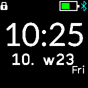
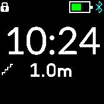
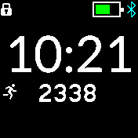

# Value Clock

A clock which different value. You can see one at the time together with the current hour and minute.
* Values:
  *  date
  *  seconds
  *  daily steps
  *  compass heading
  *  altitude (barometer based, tap for calibration with GPS)
  *  altitude diff (tap for reset)
  *  GPS altitude
  *  GPS speed
  *  battery

## Creator
[@pidajo](https://github.com/pidajo)
